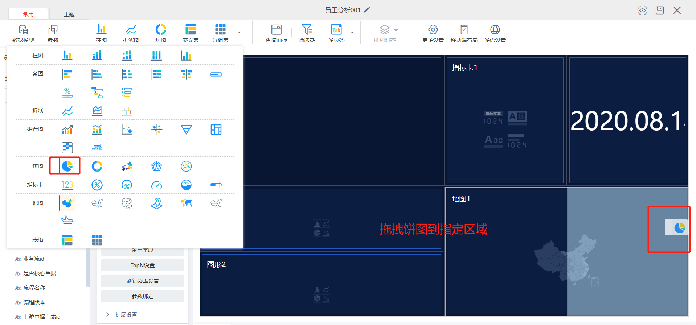

# 智能分析

## 前置条件
实体有合适的数据  
以员工信息为例，如果没有相应的数据，请下载数据并导入，具体操作请[查看导入预制数据](importdata.md#导入预制数据)，如果数据已经备好，可以直接[查看新建智能分析](#操作流程)

## 操作流程
1. 点击新建分析
   
2. 填写页面名称，选择数据模型为数据建模时员工信息实体对应的名称（含有合适数据的元数据）
   
   
3. 设置主题
   
4. 向操作台添加控件，[点击查看控件功能]()
   
   
   
   
   
   
   
   
5. 调整控件布局
   
6. 设置属性  
6.1 设置图片
   
6.2 设置指标卡   
   
   
   
   
   
6.3 设置时钟
   
6.4 设置柱状图
   
   
6.5 设置条图
   
   
6.6 设置饼图
   
   
   
   
6.7 设置环图
   
   
   
   
6.8 设置中国地图
   
   
   
7. 保存
   

## 效果展示
   
