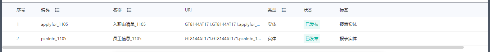

# 单据

## 新建应用

## 数据建模
* 新建入职申请实体。  
  入职申请单需要提交审批，同时下推数据到员工信息，所以引用接口选择审批、业务流、自动编码。（[点击查看各个接口具体属性](../instructions/datamodel.md)）  
  入职申请单中不同字段可以选择合适的类型，例如姓名选择文本类型、入职日期选择日期类型，目前还支持富文本、多语文本、评分等多种常用类型。（[点击查看字段类型详情](../instructions/datamodel.md)）
    
操作 | 描述 | | | ||
---|---|---|---|---|---
名称 | 入职申请单 |  |  |  |
编码 | reponse |  |  |  |
父实体 | applyfor |  |  |  |
引用接口 |  审批| 业务流 | 自动编码 |  |
|属性 | 编码 | 名称 | 类型 | 引用 
| | name| 姓名 |  文本|
| |gender | 性别 | 文本 |
| | age| 年龄 | 整数 |
| | ruzhiriqi| 入职日期 | 日期 |  
| | beizhu| 员工 | 大文本 |  
| | zidingyi1| 自定义1 | 文本 |   
| | zidingyi2| 自定义2 | 文本 |  
| | zidingyi3| 自定义3 | 文本 |   
| | zidingyi4| 自定义4 | 文本 |      
    

 
    
* 新建员工信息实体  
   
操作 | 描述 | | | ||
---|---|---|---|---|---
名称 | 员工信息 |  |  |  |
编码 | psnInfo |  |  |  |
父实体 |  |  |  |  |
引用接口 |  业务流|  |  |  |
|属性 | 编码 | 名称 | 类型 | 引用
| | code| 员工编码 |  文本| 
| | name| 姓名 |  文本|
| |gender | 性别 | 文本 |
| | age| 年龄段 | 整数 |
| | region| 大区 | 文本 |  
| | province| 省份 | 文本 |  
| | nation| 民族 | 文本 |   
| | psnclass| 人员类别 | 文本 |  
| | count| 人数 | 整数 |   
   

* 发布实体  
  实体需要发布才可在后续页面建模中引用。
    

## 页面建模
1. 切换页面建模，点击新建页面，选择【单据】页签下【单卡】，点击下一步
   > 新建页面中，单据提供单表、单卡、左树右表、左树右卡、树形表、一主多子、主子孙表等多个常用模板，可以根据业务需求进行选择。（[点击查看模板特点](../instructions/datamodel.md)）
   
2. 填写页面名称，选择【员工信息】元数据，勾选生成列表页面，点击完成。  
   这里的元数据必须为**已经发布**的实体。
   
3. 系统会自动生成【员工信息列表】、【员工信息】两个页面  
   
4. 页面展示  
   第一个为【员工信息列表】，第二个为【员工信息】  
   如果需要对页面进行设置，可以点击页面上的小眼睛进入页面设计。（[点击查看设计器布局](../instructions/datamodel.md)）
   
   

## 发布应用
1. 切换发布管理，添加分组并选择发布的页面
   
   
2. 点击发布应用，填写应用名称和一级菜单
   
   
3. 全员应用授权，设置全员可见；按F5刷新业务系统，对选择的菜单下，查看发布的应用（注意，有一定的延时，可多刷新几次看效果）
   
4. 效果展示
   