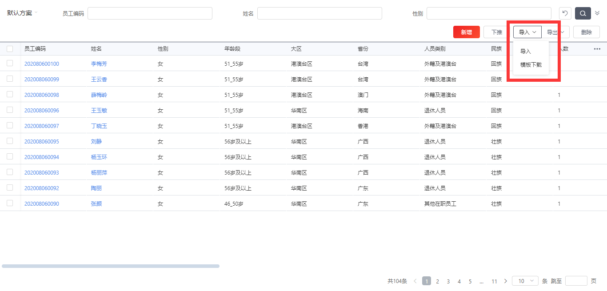
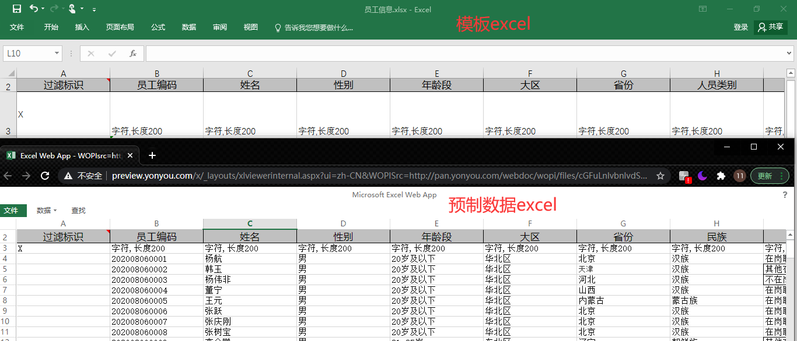
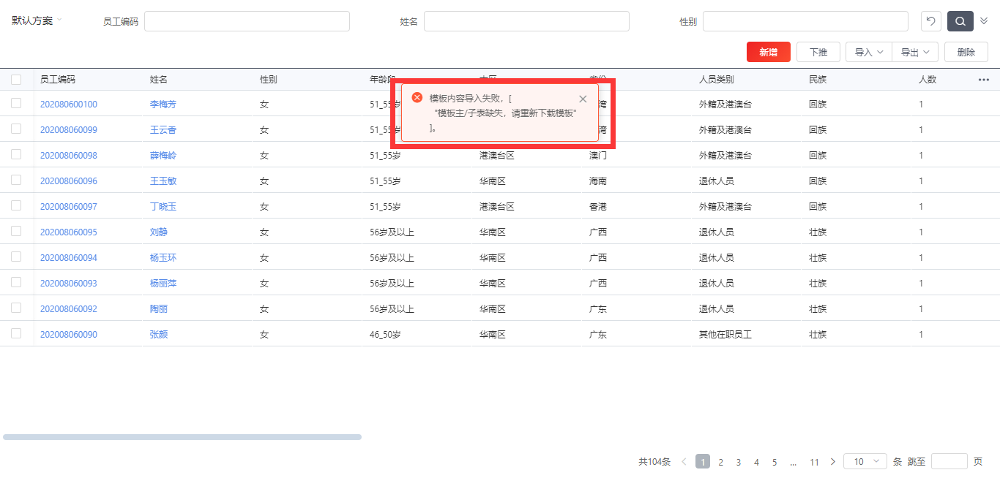
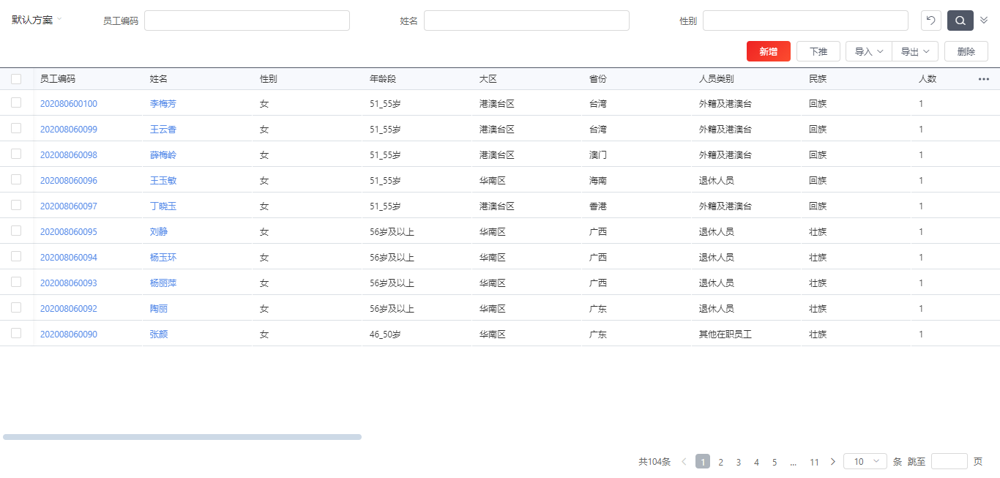

# 页面导入excel数据（以员工信息为例）
1. 下载预制数据  
   [员工信息数据](http://pan.yonyou.com/s/Oo090X2Rl0) 密码：uowd
2. 打开员工信息列表，和预制数据字段进行比较，如果位置或类型等不一致，请在导入中选择下载模板，将预制数据修改填充到模板中，再导入该模板。
   
   
   如果出现类似如下报错，请对文件进行检查或重新下载模板
   
3. 导入成功后，员工信息列表页面成功添加数据。如果没有显示，请刷新查看。
   