# 智能报表

## 前置条件
实体有合适的数据
以员工信息为例，如果没有相应的数据，请下载数据并导入，具体操作请[查看导入预制数据](importdata.md#导入预制数据)，如果数据已经备好，可以直接[查看新建智能分析报表](#操作流程)

## 操作流程
0. 下载预制表头  
   [员工信息多维度分析表头](http://pan.yonyou.com/web/share.html?hash=fmdzSQqQls) 密码：kuci
1. 点击新建页面，选择分析，报表，点击下一步
   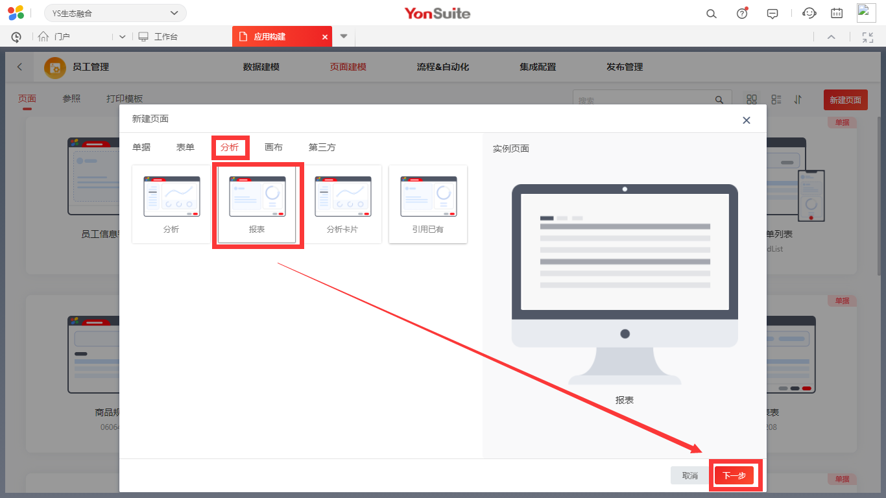
2. 设置页面名称，选择数据模型为数据建模时员工信息实体的名称（含有合适数据的元数据）
   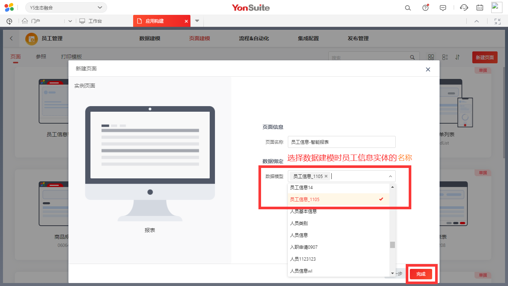
3. 新建智能报表成功，点击进行设计。
   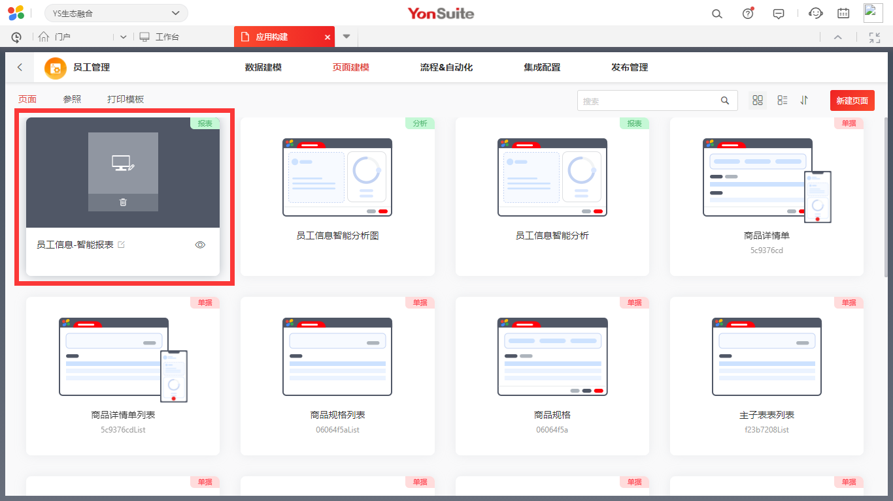
   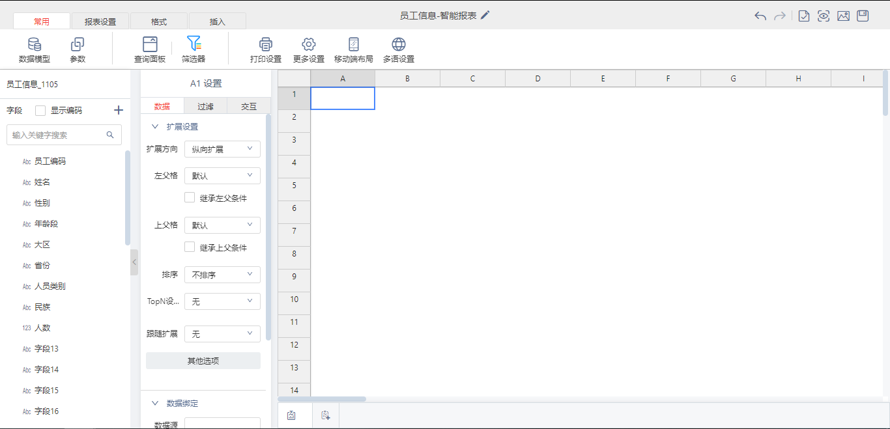
4. 在excel中将预置好的表头复制粘贴到设计窗口，选择单元格添加边框。
   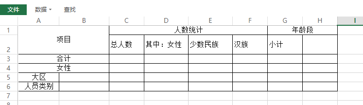
   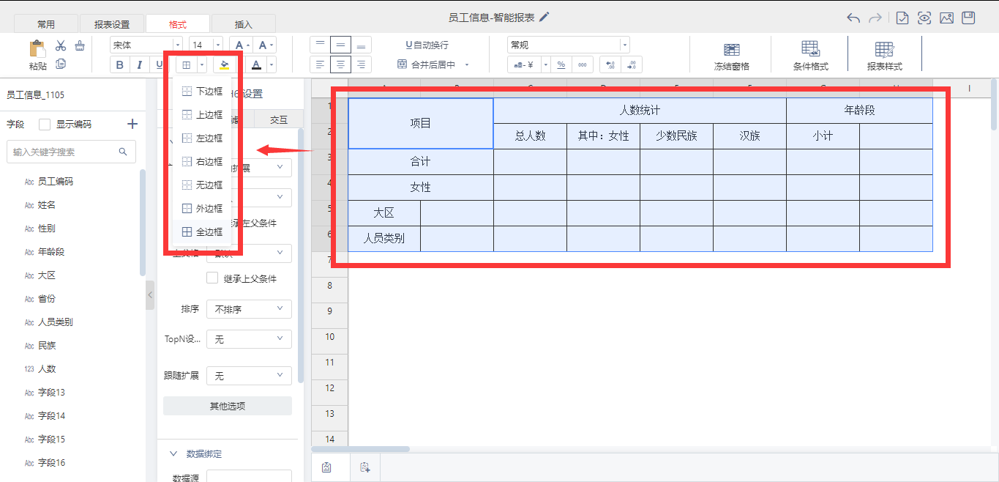
5. 设置表头字段，拖动字段到对应单元格
   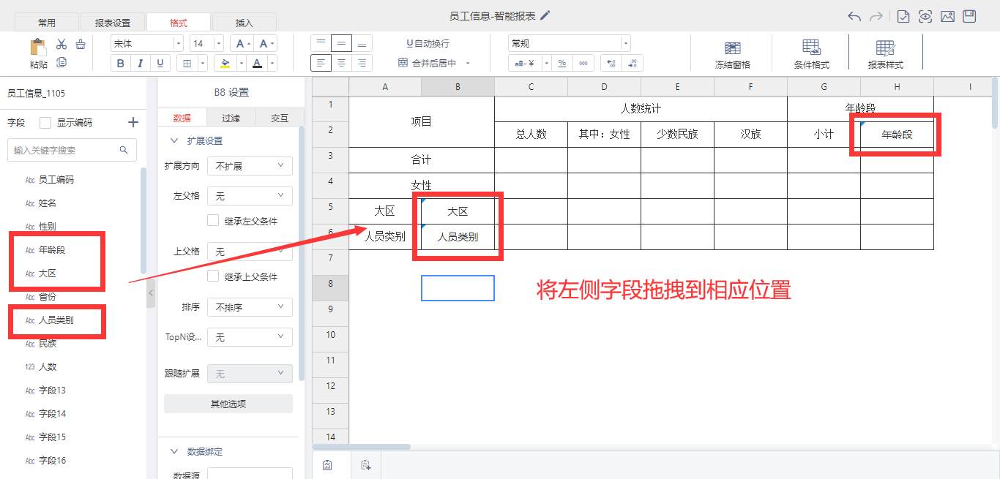
6. 设置表格内容。  
   拖动字段到对应单元格，并修改数据绑定配置，实现表内容为相应条件下的人数总计
   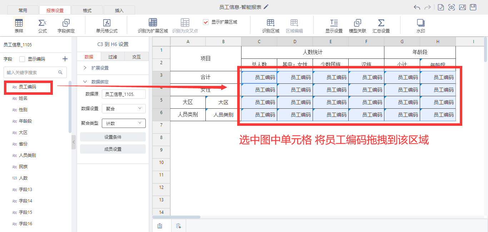
   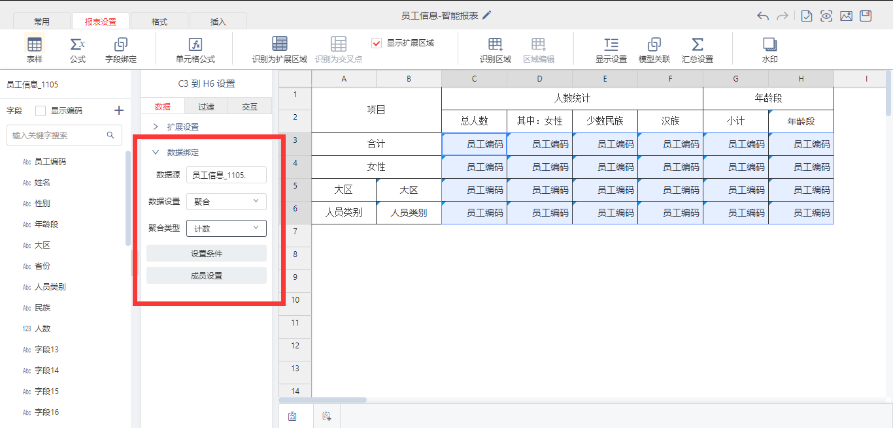
6. 设置过滤条件。  
   以“人数统计-其中：女性”为例，如图，点击单元格，设置条件。
   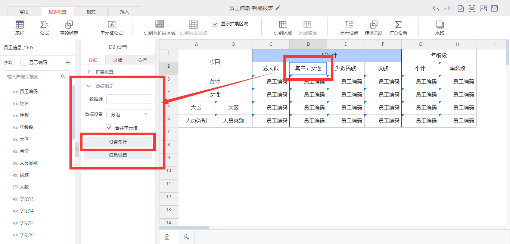
   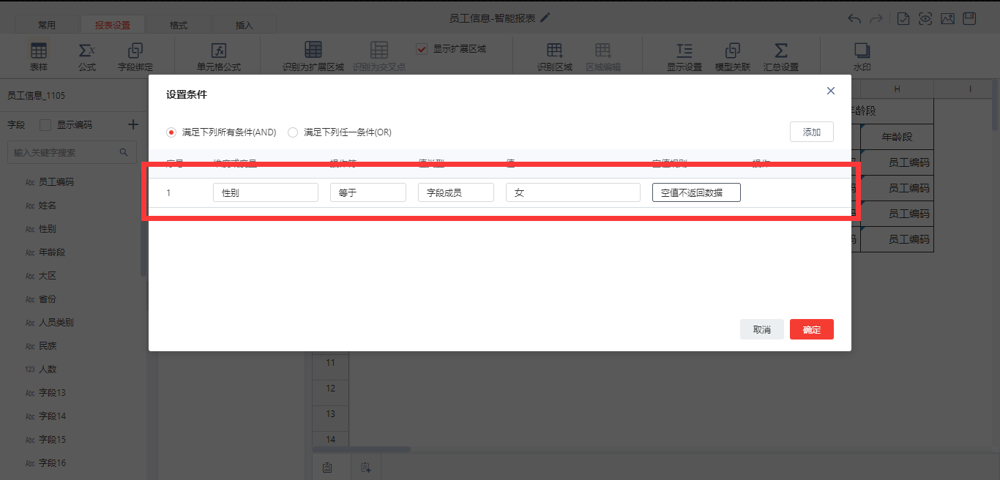
   其他需要设置的字段及条件
   
   
| 页面文本 | 维度或变量 | 操作符 | 值类型 | 值      |
| ---------- | ---------- | -------- | -------- | -------- |
| 其中：女性 | 性别     | 等于   | 字段成员 | 女      |
| 少数民族 | 民族     | 不等于 |   字段成员 | 汉族|
|汉族|民族|等于|字段成员|汉族|
|女性|性别|等于|字段成员|女|

8. 设置扩展区域，如图，设置表头横纵向扩展区域，设置表格内容交叉扩展区域
   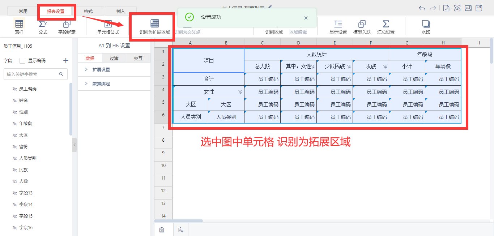
   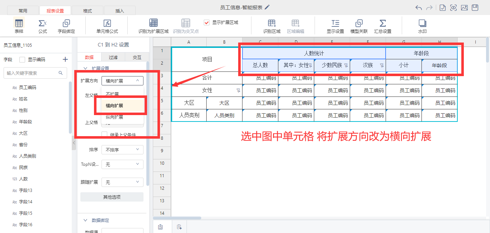
   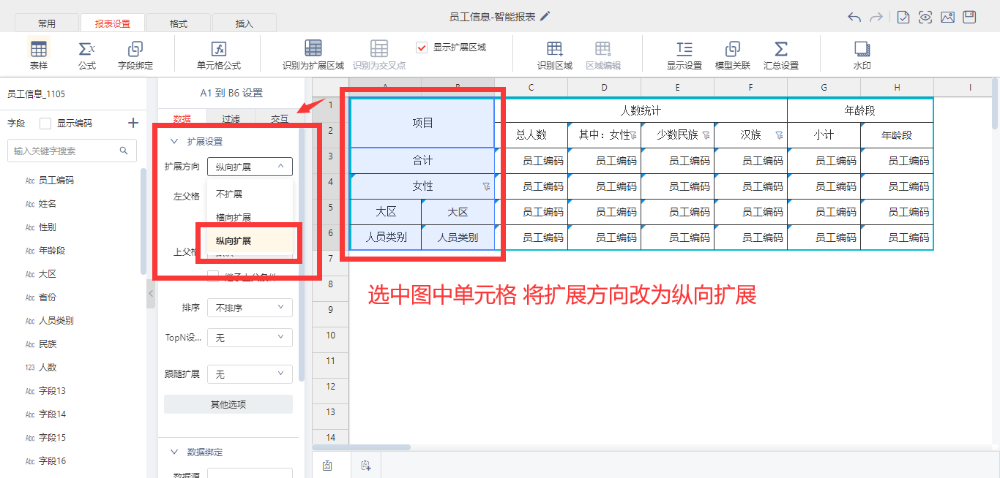
   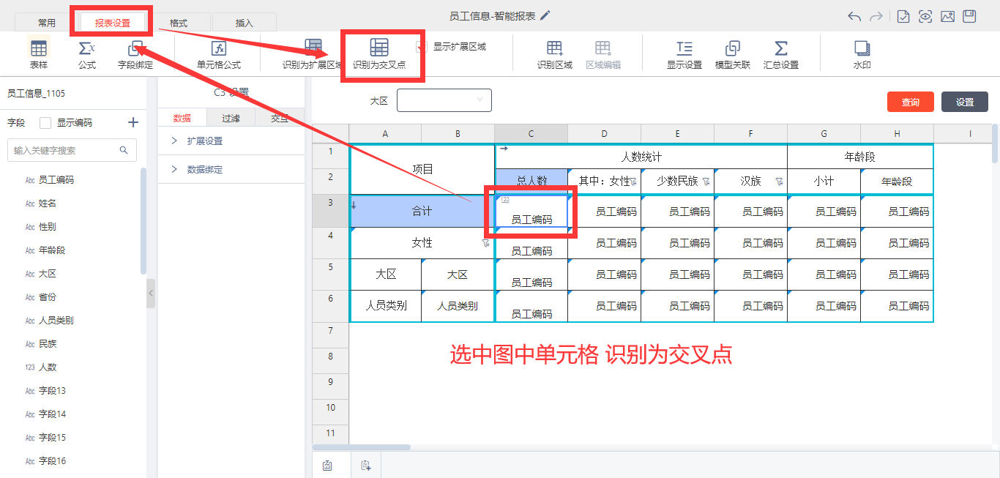
9. 添加查询面板并添加查询字段
   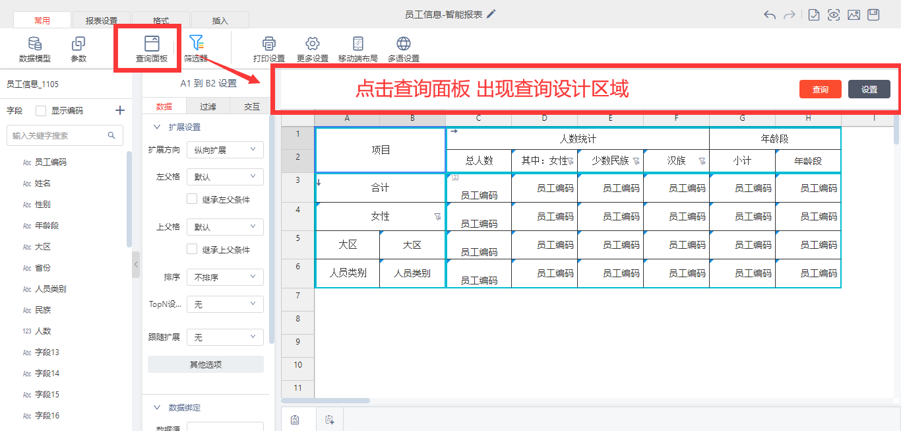
   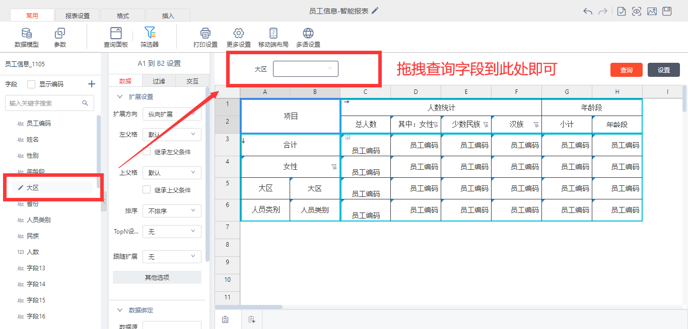
10. 点击保存

## 效果展示
1. 点击眼睛，预览智能报表；或在页面建模界面点击预览
   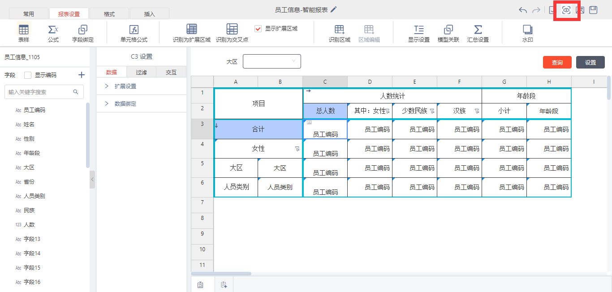
2. 展示报表内容
   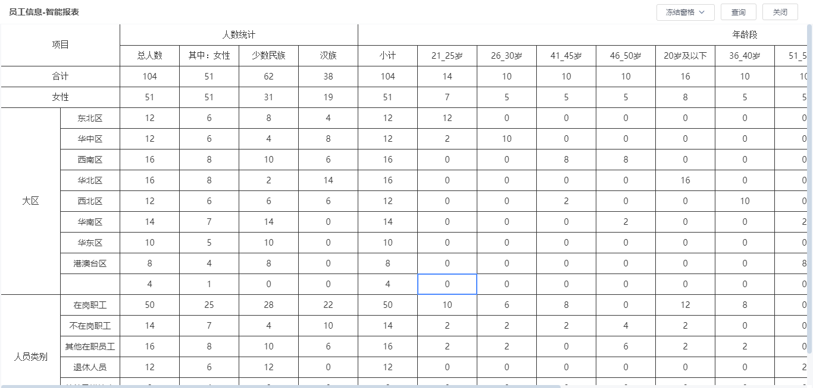
3. 点击查询，并设置查询条件，点击完成，出现相应数据
   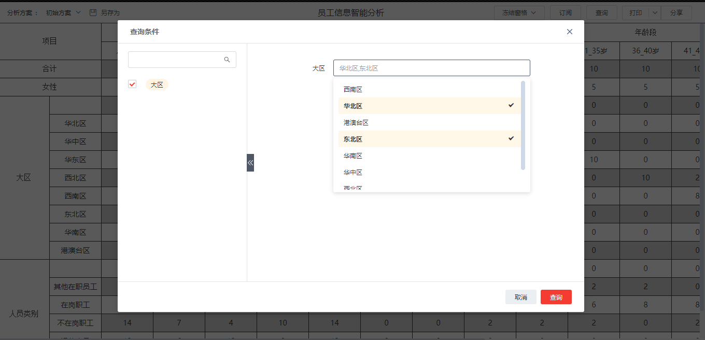
   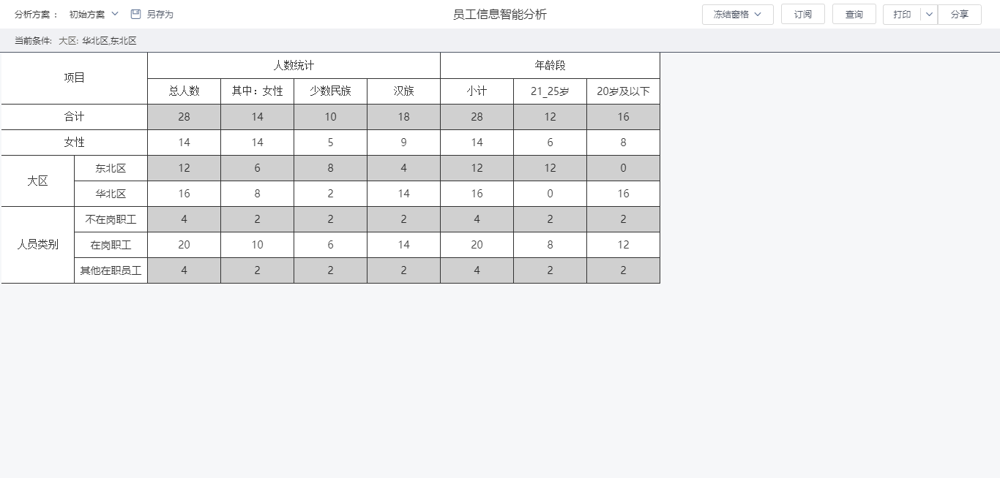

