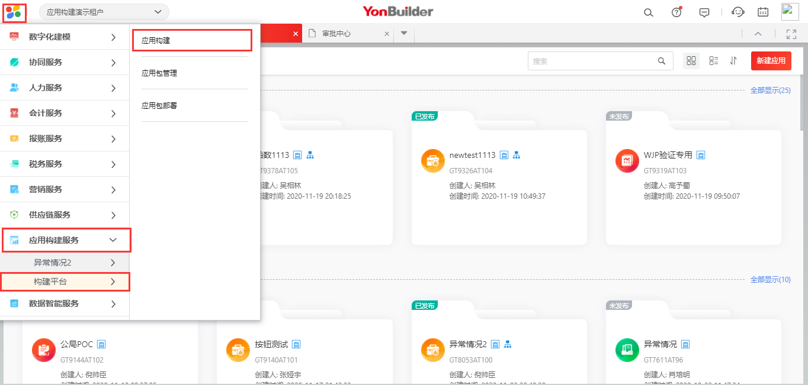
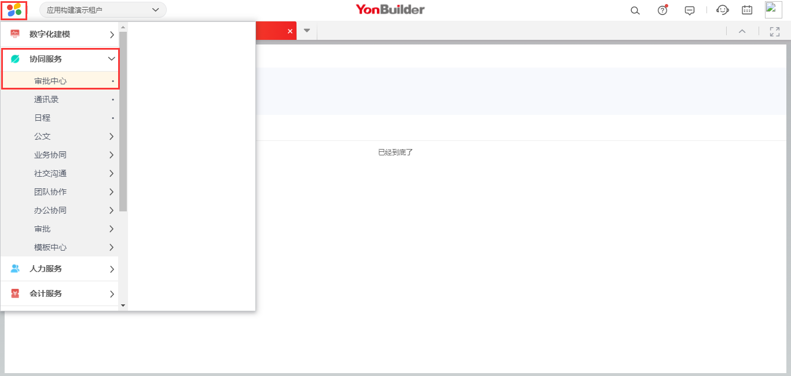

# YonBuilder学习指南

* [1 YonBuilder概述](#1-YonBuilder概述)
* [2 前置准备](#2-前置准备)
  * [2.1 概念学习](#2.1-概念学习)
  * [2.2 实践准备](#2.2-实践准备)
* [3 如何学习](#3-如何学习)
  * [3.1 学习网址](#3.1-学习网址)
  * [3.2 学习交流](#3.2-学习交流)
* [4 标准服务](#4-标准服务)
* [5 专业服务](#5-专业服务)
* [6 快速手册](#6-快速手册)
  * [6.1 常用网址](#6.1-常用网址)
  * [6.2 常用入口](#6.2-常用入口)

---

## 1 YonBuilder概述
  ### [YonBuilder二十问](http://cs-doc-manager.test.app.yyuap.com/mybook/yonbuilder/generallink/8-/question1.html)
  
## 2 前置准备
  ### 2.1 概念学习  
   * 业务中台学习（组织、RBAC、分级管控等概念）  
   * 部分概念解释  
      | 概念  | 解释 |
      |-----|----|
      | 租户  |    |
      | 元数据 |    |
      | 物料  |    |
  ### 2.2 实践准备  
   1. 申请账号。提交信息至邮箱，申请体验账号。
      * 邮箱：xiaojunt@yonyou.com （ISV及其他）  
      * 提交内容
        > 公司：  
        > 联系人:  
        > 联系方式:  
        > 开通账户列表:  
   2. 体验入口。账号申请成功后，进入体验入口。
      * 打开 `https://yonsuite.diwork.com` 并登陆账号  
      * 找到应用构建入口  
          

## 3 如何学习
  ### 3.1 学习网址
   * 摩天（学习视频）：https://www.imotian.com/motianweb/search?inVule=yonbuilder
   * 微认证（学习认证）：https://www.imotian.com/motianweb/certificationDetails?autId=51
   * 用友云平台（发版说明）：https://iuap.yonyoucloud.com/doc/yonbuilder.html##/md-build/yonbuilder/articles/yonbuilder/1-/notes.md?key=%E5%8F%91%E7%89%88%E8%AF%B4%E6%98%8E
  ### 3.2 学习交流
  描述|链接
  ---|---
  YonBuilder微信交流群|
  YonBuilder友空间交流群|

## 4 标准服务  
  [YonBuilder标准服务学习](http://cs-doc-manager.test.app.yyuap.com/mybook/yonbuilder/generallink/README1.html)

## 5 专业服务  
  [YonBuilder专业服务学习](http://cs-doc-manager.test.app.yyuap.com/mybook/yonbuilder/professionallink/)

## 6 快速手册
  ### 6.1 常用网址  
   * 数字化工作台：https://yonsuite.diwork.com  
   * 开发者中心：https://developer.yonyoucloud.com/land/builder.html   
   * 摩天学习：https://www.imotian.com  
  ### 6.2 常用入口
   * 应用构建入口   
        
   * 审批中心入口  
     